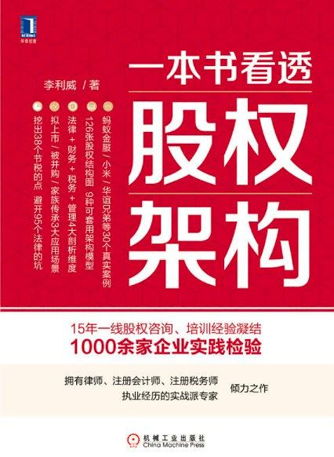

# IPOtest

IPOtest is a website. It introduces the laws and regulations related to IPO in China's share market.This website can help readers prepare for the IPO knowledge examination organized by the CSRC when the company submits the listing application materials.The website also provides some questions to help readers master the knowledge points needed to complete the exam. The purpose of this site is to test my learning of web programming. I will not pursue the commercial value of this website. In the process of making the website, I have referred to the following open source projects of GitHub:

flatdoc

ditto

ECMAscript 6 入门

# IPO知识辅导及考题

IPOtest是一个网站。介绍了中国A股市场IPO相关的法律法规知识。公司在提交上市申请材料时，公司的董监高需要完成证监会组织的IPO知识考试，这个网站可以帮助读者备考用。网站同时给出了部分考题，帮助读者掌握完成考试需要的知识点。

本网站的读书笔记来自我最近读的《一本书看透股权架构》，作者李利威。本书作者拥有律师、注册会计师、注册税务师执业经历，服务过联想控股、拉卡拉等百余家公司的股权设计项目。本书是其15年实战经验的系统总结。

做这个网站的目的是检验一下自己对web前端的学习成果。本人不会追求这个网站的商业价值。做网站过程中，我参考了GitHub的以下开源项目：

[flatdoc](https://github.com/rstacruz/flatdoc)

[ditto](https://github.com/chutsu/ditto)

ECMAscript 6 入门(https://github.com/ruanyf/es6tutorial)

### 版权许可

本书采用“保持署名—非商用”创意共享4.0许可证。

详细的法律条文请参见[创意共享](http://creativecommons.org/licenses/by-nc/4.0/)网站。
