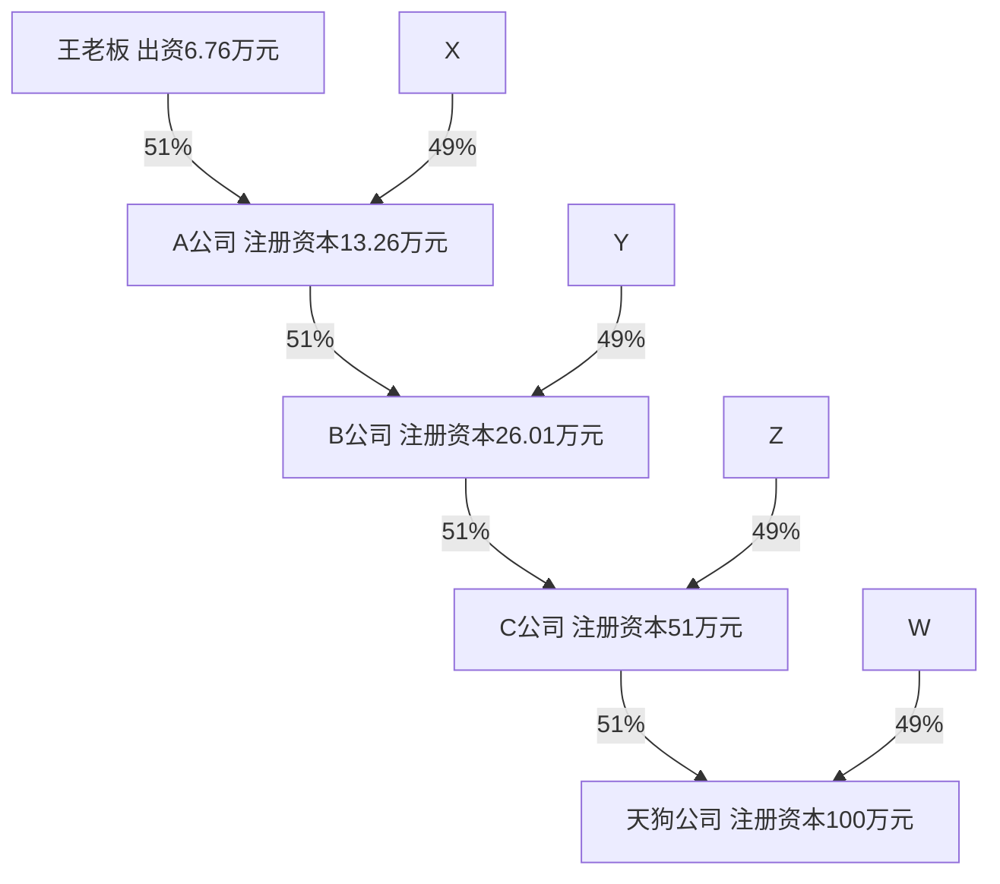

### 金字塔架构

```mermaid
graph TB
A[王老板 出资6.76万元]
B[A公司 注册资本13.26万元]
C[B公司 注册资本26.01万元]
D[C公司 注册资本51万元]
E[天狗公司 注册资本100万元]
X[X]
Y[Y]
Z[Z]
W[W]
A-->|51%|B-->|51%|C-->|51%|D-->|51%|E
X-->|49%|B
Y-->|49%|C
Z-->|49%|D
W-->|49%|E
```
